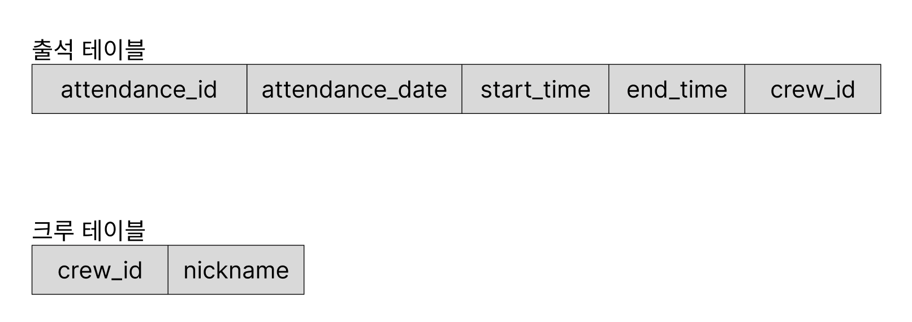

# 문제

## 1번 문제
### crew 테이블에 들어가야할 크루들의 정보

```sql
select distinct (crew_id), nickname
from attendance;
```

### 최종적으로 crew 테이블 생성

```sql
create table `crew`
(
    `crew_id`  INT         NOT NULL AUTO_INCREMENT,
    `nickname` VARCHAR(50) NOT NULl,
    PRIMARY KEY (`crew_id`)
);
```

### attendance 테이블에서 크루 정보를 추출해서 crew 테이블에 삽입하기

```sql

insert into crew (nickname)
values  ('검프'),
        ('구구'),
        ('네오'),
        ('브라운'),
        ('브리'),
        ('포비'),
        ('워니'),
        ('리사'),
        ('제임스'),
        ( '류시');
```


## 2번 문제

```sql
alter table attendance drop column nickname;
```


## 3번 문제

```sql
ALTER TABLE attendance
ADD CONSTRAINT FK_ATTENDANCE_CREW_CREW_ID
FOREIGN KEY (crew_id) REFERENCES crew (crew_id);
```

## 4번 문제
```sql
ALTER TABLE crew
ADD CONSTRAINT UQ_CREW_NICKNAME UNIQUE (nickname);
```


## 5번 문제

```sql
select *
from crew c
where nickname like '디%';
```

## 6번 문제

```sql
select *
from attendance a
left join crew
on a.crew_id = crew.crew_id
where crew.nickname = '어셔';
```

## 7번 문제

```sql
insert into crew (nickname) values ('어셔');


INSERT INTO attendance (crew_id, attendance_date, start_time, end_time)
VALUES (
    (SELECT crew_id FROM crew WHERE nickname = '어셔'),
    '2026-03-06',
    '09:31:00',
    '18:01:00'
);
```

## 8번 문제

```sql
update `attendance`
set `start_time` = '10:05:00'
where
    crew_id = (select crew_id
               from crew
               where nickname = '제임스')
and
    attendance_date = '2025:03:12';

## 확인
select *
from attendance
where crew_id = (select crew_id
               from crew
               where nickname = '제임스');
```

## 9번 문제

```sql
delete
from `attendance`
where crew_id = (select crew_id
                 from crew
                 where nickname = '디노')
and
    attendance_date = '2025-03-12';
```


## 10번 문제

```sql
select *
from attendance a, crew c
where a.crew_id = c.crew_id
and c.nickname = '이름';

select *
from attendance
left join crew
on attendance.crew_id = crew.crew_id
where crew.nickname = '이름';
```

## 11번 문제

```sql
select *
from attendance
where crew_id = (
    select crew_id
    from crew
    where nickname = '디노'
    );
```

## 12번 문제

```sql
select c.nickname
from attendance a, crew c
where a.crew_id = c.crew_id
and a.attendance_date = '2025-03-05'
order by a.end_time desc
limit 1;


# MAX 처리
select c.nickname
from crew c
left join attendance
on c.crew_id = attendance.crew_id
where attendance_date = '2025-03-05'
and end_time = (select MAX(end_time)
from attendance
where attendance_date = '2025-03-05');
```

## 13번 문제

```sql
select c.nickname, count(*) as attendance_date_count
from attendance a, crew c
where a.crew_id = c.crew_id
group by c.nickname;
```

## 14번 문제

```sql
SELECT c.nickname, COUNT(a.start_time) AS attendance_date_count
FROM crew c
JOIN attendance a ON c.crew_id = a.crew_id
WHERE a.start_time IS NOT NULL
GROUP BY c.nickname;
```

## 15번 문제

```sql
select a.attendance_date, count(c.crew_id) as total_crew_count
from attendance a, crew c
where a.crew_id = c.crew_id
group by a.attendance_date;

select a.attendance_date, count(c.crew_id) as total_crew_count
from attendance a
join crew c on a.crew_id = c.crew_id
group by a.attendance_date;
```

## 16번 문제

```sql
select c.nickname as '닉네임', min(a.start_time) as '가장 빠른 등교시간', max(a.start_time) as '가장 늦은 등교시간'
from attendance a, crew c
where a.crew_id = c.crew_id
group by a.crew_id;

select c.nickname as '닉네임', min(a.start_time) as '가장 빠른 등교시간', max(a.start_time) as '가장 늦은 등교시간'
from attendance a
join crew c on a.crew_id = c.crew_id
group by a.crew_id;
```


# 생각해보기

## 1. 기본키란 무엇이고 왜 필요한가?

각 레코드를 고유하게 식별하는 기본키가 없다면, 특정 데이터를 찾는데 불편함이 존재하며, 심하게는 조회할 수 없게 됩니다.

이를 방지하기 위해서는 중복되는 컬럼을 조합하여 고유한 키를 만들어야하는데, 이런 불편함을 개선할 수 있다고 생각합니다.

## 2. MySQL에서 사용되는 AUTO_INCREMENT는 왜 필요할까?

데이터를 저장할 때, 어플리케이션 레벨에서 PK를 지정하게되면 번거로운 일이 많습니다. 1부터 증가하는 숫자를 PK로 사용하고자 한다면, 가장 마지막에 저장된 PK 숫자가 무엇인 지 어플리케이션 레벨에서 저장하거나 조회해야합니다. 

PK를 1부터 증가하는 숫자가 아니라 UUID같은 서로 다를 수 있는 문자로 저장할 수 있으나, 완벽한 고유성을 보장하지는 않습니다.

## 3. 학생이 등교는 했지만 하교 버튼을 누르지 않았을 때, end_time에 NULL이 저장된다. NULL 값을 처리할 때 주의할 점은?

SQL에서 주로 사용하는 비교 연산자 =가 NULL에 적용되지 않습니다. 

NULL을 비교하기 위해서는 IS NULL을 적용해야합니다.

## 4. crew와 attendance 테이블의 관계를 ER 다이어그램으로 시각화해보자. 이 관계를 일상 생활의 예시로 비유한다면 어떤 것이 있을까?

학생 - 수강과목, 고객-주문, 크루-출석, 상품-상품주문-주문



## 5. 출석 시스템에서 동시에 100명이 등교 버튼을 누른다면 어떤 일이 일어날까? 이 문제를 2026 공통강의 - DB에서 배운 트랜잭션과 ACID 속성으로 설명해보자.

동시에 잘 데이터가 삽입됩니다.
질문의 어감 상 동시성 문제가 발생할 것으로 느껴졌습니다.
그러나 제가 생각하기에, 학생 100명이 등교 버튼을 눌러도 결국 자신의 출석 정보를 추가하는 것이기 때문에, 동시성 문제는 발생하지 않을 것이라 생각했습니다.

이론을 증명하기 위해서 실제 테스트도 진행해보았습니다. 
테스트 중, 추가로 든 궁금증도 다음 블로그 글로 정리해보았습니다.

[정리글](https://koreaioi.tistory.com/199)

## 6. 출석 데이터가 파일(CSV)이 아닌 데이터베이스에 저장되는 이유는 무엇일까? 파일 시스템으로 출석을 관리했다면 어떤 문제가 생길까?

파일 시스템은 흔히, 맥이나 윈도우에서 사용하는 파일시스템을 떠올릴 수 있다.

가장 불편한 점은 원하고자하는 파일을 찾는데 오랜 시간이 걸린다는 점이다.

그리고 데이터 무결성을 지키기 힘듭니다. 출석시간을 시간형식이 아니라 문자열로 바뀌어도 검증하기 힘듭니다. DB는 해당 컬럼에 데이터 형식을 지키기만 하면 되니까요!


## 7. 출석 데이터를 관계형 DB가 아닌 NoSQL(예: MongoDB)로 저장한다면 테이블 구조가 어떻게 달라질까? 어떤 장단점이 있을까?

```json
{
  "crew_id": 12345678,
  "nickname": "송송",
  "attendances": [
    {"attendance_date": "2026-04-01", "start_time": "09:00:00", "end_time":"18:00:00"},
    {"attendance_date": "2026-04-02", "start_time": "09:00:00",
    "end_time":"18:00:00"}
  ]
}
```

다음과 같이 테이블 구조가 달라질 것이라 생각합니다.
RDB의 경우 SQL을 통해, 정교한 통계처리가 쉬울 것 같습니다.
그러나 NoSQL의 경우는 어려울 것 같습니다. 
위의 테이블 구조는 아니지만, NoSQL은 데이터 구조에 자유롭기 때문에 그만큼 동일한 기준에 대해서 분석해야하는 통계 처리는 어려울 것 같아요.

# 🧐 더 생각해 보기 (심화)

## 왜 crew 테이블에서 nickname을 기본키로 하지 않은 걸까? attendance 테이블에 attendance_id가 존재하는 이유는 무엇일까?

대리키를 사용하게 되면 두 가지 이상의 조합으로 레코드를 조회해야하기 때문에 성능상 좋지 않을 것 같습니다.

## 데이터베이스 제약 조건 중 RESTRICT, CASCADE는 무엇인가?

RESTRICT는 제한한다는 의미입니다.
FK의 대상이 존재하는 경우 삭제할 수 없다는 외래키 제약 조건이 생각납니다!

CASCADE는 참조 대상이 삭제되는 경우, 그의 참조값을 지닌 테이블의 레코드도 삭제되는 것을 의미합니다.

## 다음 두 쿼리는 동일한 결과를 반환하지만 성능에 차이가 있다. 어떤 차이가 있으며, 어떤 상황에서 각각 유리할까?

서브 쿼리를 사용하면, 성능 상으로 조인보다 좋지 않습니다.
그러나, SQL 쿼리를 보면 무엇을 조회하고자하는 지 비교적 명확하게 드러나서 좋다고 생각합니다.


JOIN을 사용하면, 실행계획이 직관적이며, 성능이 좋습니다.


## attendance 테이블을 완전히 정규화하면 어떤 장점이 있을까? 반대로 일부 비정규화를 적용한다면 어떤 쿼리 성능 이점을 얻을 수 있을까?

데이터의 중복이 줄어들고, 정말 관련 혹은 연관있는 컬럼끼리 테이블을 구성할 수 있다. (저장 공간 절약!)

비정규화를 한다면 데이터의 중복은 증가하지만, 테이블이 분리되어있지 않아, Join 횟수가 줄어들어 성능상의 이점이 존재한다.


## 출석 시스템이 수백 명의 사용자에 의해 동시에 접근된다면, 연결 풀링(connection pooling)은 무엇이고 왜 필요한가?

커넥션을 생성하는 행위는 비용이 매우 비싼 것으로 알고 있습니다.
때문에 수백 명의 사용자가 요청을 할 때, 그때마다 커넥션을 새로 생성하는 것은 요청을 적절히 처리하지 못하는 수단이 될 거라 생각합니다.

따라서 커넥션을 일정량 미리 만들어두고 저장합니다.
요청이 들어오면 사용하고 응답하면 반납하는 식으로 사용합니다.
min, max connection 수를 정하여, 요청이 적을 때에는 최소한의 커넥션을 생성해둘 수 있는 것으로 알고 있습니다.

## 실습에서 수행한 INSERT, UPDATE, DELETE를 하나의 트랜잭션으로 묶는다면 어떻게 작성할 수 있을까? 만약 DELETE 도중 오류가 발생하면 앞서 수행한 INSERT와 UPDATE는 어떻게 되어야 할까?

하나의 트랜잭션으로 묶는 것은, 해당 트랜잭션 내의 쿼리가 모두 동작하거나 동작하지 않아야한다는 걸 의미합니다.

따라서 중간에 한 쿼리에 오류가 발생하면 여러 쿼리중 하나만 실패할 수 없으므로, 롤백되어야합니다!

```sql
BEGIN;
INSERT
UPDATE
DELETE
COMMIT;
```